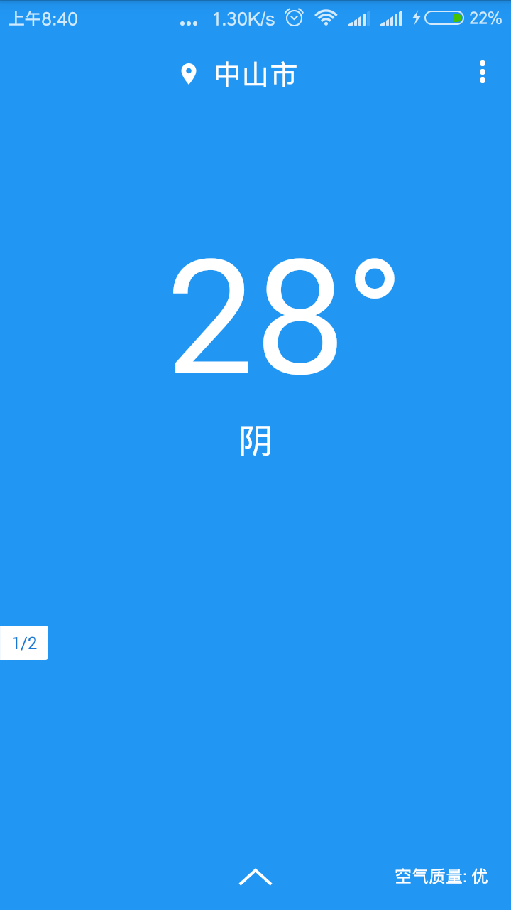
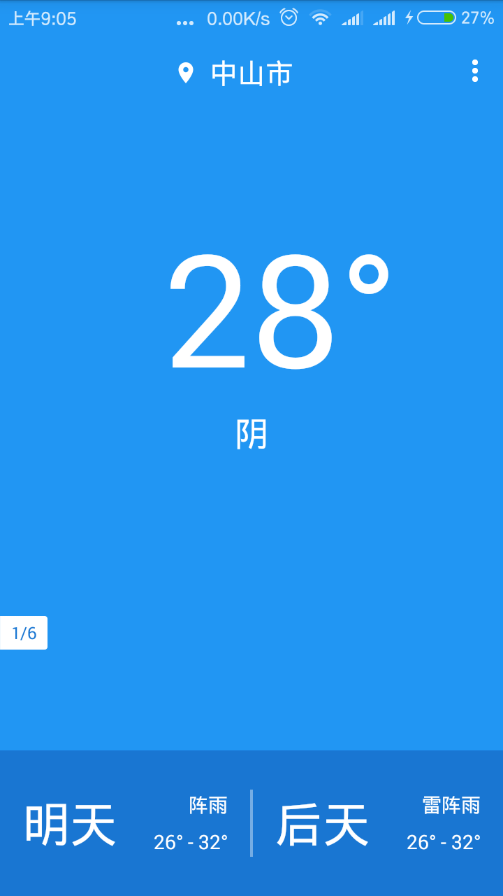
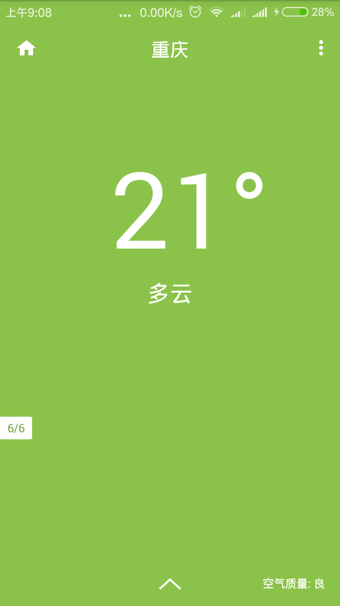
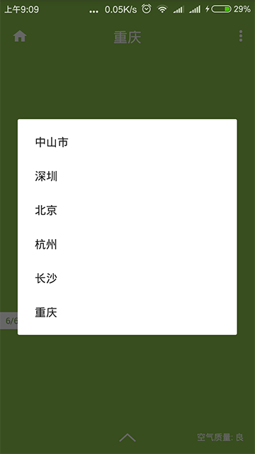
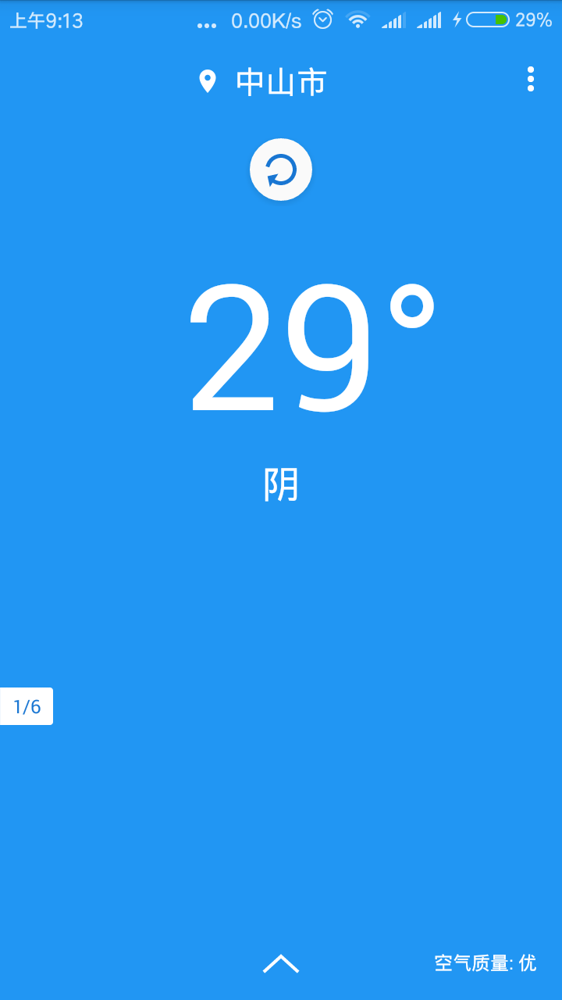
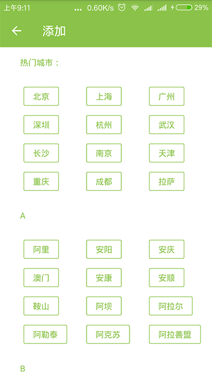

# App名称：简单天气

**简介**：一个简洁的天气App。

> **持续更新**

**功能：**

* 预报当前天气情况
* 预报当前气温。
* 预报当前空气质量。
* 预报未来两天的天气情况。
* 根据空气质量动态改变背景颜色。
* 支持动态添加/删除以及撤销删除城市。
* 支持下拉刷新。
* 通过左右滑动来切换不同的城市。
* 通过点击左下方的页面指示器来快速切换城市。

**说明：**

* 使用[高德地图](http://lbs.amap.com/)定位使用者当前所处的城市。
* 天气接口使用的是[和风天气](https://www.heweather.com/)提供的免费接口。

**参考图：**

---

# End
