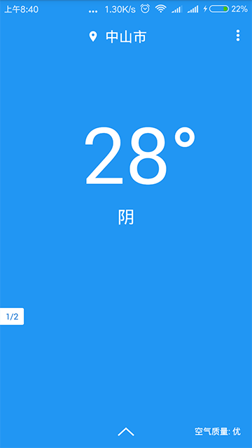
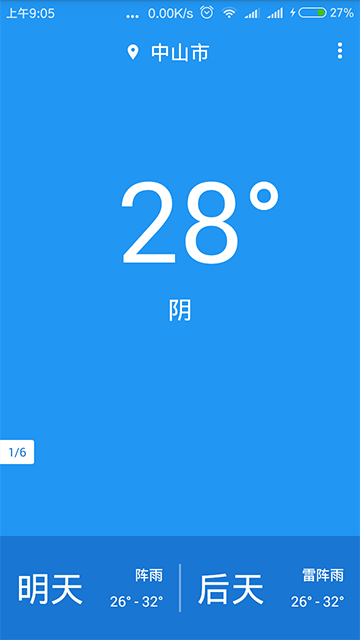
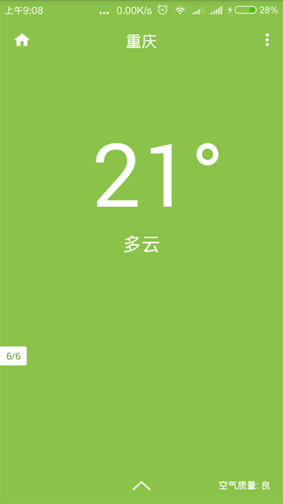
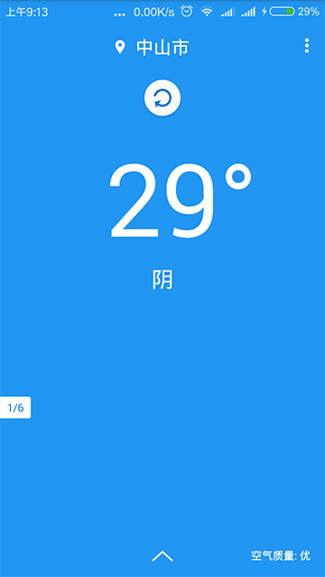

# App名称：简单天气

**简介**：一款非常简洁的天气App。

> **不定期更新**

**功能：**

* 预报当前气温。
* 预报当前天气情况
* 预报当前空气质量。
* 预报未来两天的天气情况。
* 根据空气质量动态改变页面背景颜色。
* 支持动态添加/删除以及"撤销删除"城市。
* 支持下拉刷新。
* 通过左右滑动来切换不同的城市。
* 支持点击左上角的Home按钮快速回到主页。
* 支持点击左下角的页面指示器快速在各个页面之间切换。

**说明：**

* 使用[高德地图](http://lbs.amap.com/)定位使用者当前所处的城市。
* 天气接口使用的是[和风天气](https://www.heweather.com/)提供的免费接口。

**注意：**

* 如果你替换了天气接口，那么请重新实现 Weather 类的 update() 方法，以完成对数据的解析。
* 如果你换用了其他定位服务（如百度定位），那么请重新实现 SWApplication 的 location() 方法。

> **提示：城市列表作为字符串资源存放在 strings.xml 文件中，你可以自由修改/修正。**

**App参考图：**

 

 

 

---

# End
